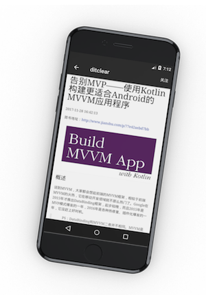

# PaoNet
泡网第三方客户端（待完善）

技术栈 : MVVM/Kotlin/DataBinding/Rxjava2/Retrofit2/Room/Koin/AOP/Navigation

[demo下载](https://github.com/ditclear/PaoNet/releases/download/1.0/app-release.apk)

[Wanndroid 版本 Apk](https://github.com/ditclear/PaoNet/releases/download/wanandroid/demo.apk)

> 因为泡网的接口服务时常不稳定，因此提供了适配了wanandroid版本的apk,也可以拉取[wanandroid分支](https://github.com/ditclear/PaoNet/tree/wanandroid)编译运行

##### 项目介绍

| Sample                                                       | Description                                                  |
| ------------------------------------------------------------ | ------------------------------------------------------------ |
| [master](https://github.com/ditclear/PaoNet)                 | 稳定版本                                                     |
| [develop](https://github.com/ditclear/PaoNet/tree/develop)   | 开发分支                                                     |
| [wanandroid](https://github.com/ditclear/PaoNet/tree/wanandroid)   | wanandroid 版本A，包含项目、公众号、搜索等功能                                                     |
| [modularization](https://github.com/ditclear/PaoNet/tree/modularization) | 伪·模块化(工程化)分支，基于BuildType和SourceSet进行的工程化改造 |
| [sinlge_page](https://github.com/ditclear/PaoNet/tree/single_page) | 基于[Navigation](https://developer.android.google.cn/topic/libraries/architecture/navigation/navigation-implementing)组件，对PaoNet进行了单页面(单Activity+多Fragment)改造 |
| [multi_module](https://github.com/ditclear/PaoNet/tree/multi_module) [WIP] | 基于[sinlge_page](https://github.com/ditclear/PaoNet/tree/single_page)分支进行的模块化改造 |

### 遵循架构

#### 小专栏

- [使用Kotlin构建MVVM应用程序—总览篇](https://xiaozhuanlan.com/topic/1736458920)

- [使用Kotlin构建MVVM应用程序—第一部分：入门篇](https://xiaozhuanlan.com/topic/7590648312)

- [使用Kotlin构建MVVM应用程序—第二部分：Retrofit及RxJava](https://xiaozhuanlan.com/topic/9560382174)

- [使用Kotlin构建MVVM应用程序—第三部分：Room](https://xiaozhuanlan.com/topic/8076241593)
- [使用Kotlin构建MVVM应用程序—第四部分：ViewModel](https://xiaozhuanlan.com/topic/6705498213)
- [使用Kotlin构建MVVM应用程序—第五部分：依赖检索容器Koin](https://xiaozhuanlan.com/topic/1562439780)
- [使用Kotlin构建MVVM应用程序—第六部分：LiveData](https://xiaozhuanlan.com/topic/9753861024)
- [使用Kotlin构建MVVM应用程序—第七部分：单元测试](https://xiaozhuanlan.com/topic/9320864751)
- [使用Kotlin构建MVVM应用程序—完结篇：快速开发](https://xiaozhuanlan.com/topic/7635981042)

### Todo

- [ ] 横屏支持
- [ ] 单元测试
- [ ] TDD开发
- [ ] Material Design
- [ ] 多语言支持

### 关于我

简书 ：[ditclear](https://www.jianshu.com/u/117f1cf0c556)

掘金 ：[ditclear](https://juejin.im/user/582d601d2e958a0069bbe687)

小专栏 ：[ditclear](https://xiaozhuanlan.com/u/2493325177)

Github : [ditclear](https://github.com/ditclear)

微信公众号：ditclear

### License

The MIT License 

